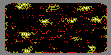
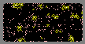

# TextImageSearch

Detects text pattern in a noisy ASCII image and outputs multiple .png file, each representing a different stage in the program. Produces one image per pattern.

## Features
- Detects a text pattern inside and around a text image
- Enhances image by searching for hotspots and identifying them with a unique color
- Stores statistics on confidence values to do first pass filtering
- Performs post filtering by identifying lone points and identifying them with a unique color
- Renders a .png image representing the image detection using statistics to filter low confidence points

### Example
Detects all occurences of a [text pattern](src/main/resources/pattern1.txt) inside and around a [text image](src/main/resources/image.txt) and renders an output image representing the match, white represents the enhanced hot spots.
     

In the below images red and pink represent the points removed by post filtering
    

### Process
* Create all assets (TextImages and PatternTextImages)
* Iterates through all points, including ones outside the original text image and determines the confidence value
* Store confidence value in Statistics for computation of standard deviation and mean.
* Write an "original" image for the user to identify the patterns pre-filtering
* Performs enhancement on the confidence values which identifies the center point of found patterns
* Write an "enhanced" image for the user to identify the points which have been enhanced
* Performs filtering on the confidence values which removes lone points and renders a "final" image

### Potential Improvements
- Add JUnit tests
- Method level documentation
- A single output image with all patterns represented
